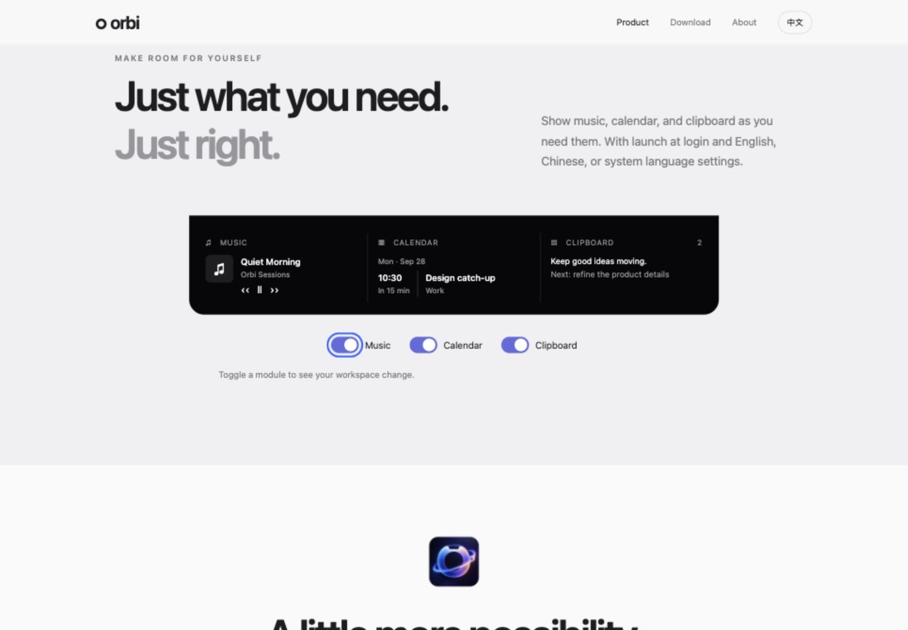
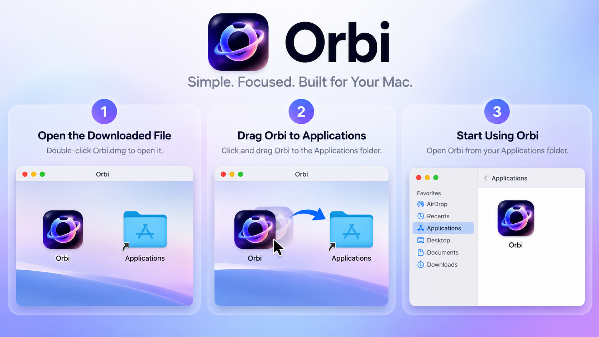

  
  <h1>Orbi for Mac</h1>
  
<strong>Your everyday essentials. Right at the top of your Mac.</strong>

  
Music, calendar, and clipboard in one lightweight notch workspace.

  

    <a href="https://kaitangkevin.github.io/orbi-website/">Explore the Website</a> ·
    <a href="https://kaitangkevin.github.io/orbi-website/download/">Download & Setup</a> ·
    <a href="#about-the-developer">Meet the Developer</a>
  

  
<strong>macOS · Version 1.0 · Independently Developed</strong>

---

## Meet Orbi

Skip a song. Check what’s next. Find the text you just copied. Orbi brings these everyday actions together at the top of your Mac, so you can spend less time switching windows and more time on what matters.

Move your pointer into the notch area to open your workspace. Move away, and it returns to a compact view. It’s a small addition to your desktop, designed around the things you do throughout the day.

**This repository contains the Orbi website, presentation assets, and installer—not the native macOS application’s source code.** Public visibility does not grant an open-source license. See [Copyright & Usage](#copyright--usage).

## What Orbi Can Do

| Feature | Capabilities | What to know |
| --- | --- | --- |
| **Notch workspace** | Hover to expand; move away to collapse after a short delay | Lives at the top of the screen, with a menu bar entry |
| **Apple Music controls** | Track and artist details, play/pause, previous and next track | Requires automation access to the Music app |
| **Audio activity** | App name, playback activity, and a responsive waveform for other audio sources | Universal track details and playback controls are not claimed |
| **Today’s calendar** | Current or upcoming event, start time, and calendar name | Requires calendar access |
| **Text clipboard** | Up to 15 recent text entries, click to copy again, and clear history | Text history; not a file or image clipboard |
| **Personalization** | Choose visible modules and launch at login | Hiding a module does not revoke permissions or stop monitoring |
| **Language options** | English, Simplified Chinese, or your system language | The website also supports English and Chinese |

## Take a Closer Look

Captured at a **1440 × 1000 desktop viewport**. These screenshots show the website’s interactive product demonstrations with sample content, not native app captures. Try the demos on the [website](https://kaitangkevin.github.io/orbi-website/).

### One workspace, within reach

Music, your next event, and recently copied text appear together in an expandable panel.

### Keep good ideas moving

Find recent text without retracing your steps. Select a clipboard entry to bring it back into your workflow.

### Make room for what you need

Choose which modules appear in your workspace. Keep the essentials visible and the rest out of the way.

## Download & Install

**[Download Orbi 1.0 for Mac](https://kaitangkevin.github.io/orbi-website/downloads/Orbi-1.0.dmg)** · DMG · Approximately 3.4 MB

1. Download and open **Orbi-1.0.dmg**.
2. Drag **Orbi** into **Applications** and wait for the copy to finish.
3. Open Orbi from Applications, then move your pointer to the top center of your screen.
4. Review the permission requests and choose your preferred modules and language in Settings.

*Installation illustration provided by the developer. The image’s “Orbi.dmg” refers to the “Orbi-1.0.dmg” download linked above.*

### Before your first launch

The current installer **does not have an Apple Developer ID signing certificate**. macOS may be unable to verify the developer or check the app for malicious software. Only proceed if you trust the source, know the file has not been altered, and accept the risks of unsigned software.

Read the [first-launch guide](https://kaitangkevin.github.io/orbi-website/download/#install) and [Apple’s official guidance](https://support.apple.com/en-us/102445). Do not disable system-wide security protections.

Minimum macOS version and chip compatibility have not been formally confirmed. Do not assume support for every Mac.

## Permissions & Data Access

| Access | Purpose |
| --- | --- |
| **Calendar** | Reads and displays your schedule. The current app requests full calendar access. |
| **Automation: Music** | Reads current Apple Music information and sends playback commands. |
| **System audio** | Detects audio activity to drive the waveform; review any macOS authorization prompts. |
| **Clipboard** | Monitors newly copied text while Orbi is running and keeps up to 15 entries. |

**Module visibility is separate from data access.** Hiding the clipboard module does not stop monitoring in the current version. Quit Orbi to stop it. Manage applicable system permissions in macOS Settings.

The website demos use sample data and do not access your music, calendar, or clipboard. The installed app and website demos are separate environments.

## About the Developer

I’m **[Kaitangkevin](https://github.com/Kaitangkevin)**, the independent developer behind Orbi.

Orbi is my personal product project. I’m building it around a simple idea: the small actions you repeat every day should feel easier, clearer, and less distracting. A useful tool should be there when you need it and give you space when you don’t.

My focus is on refining the everyday experience: thoughtful interactions, practical features, and a workspace that fits naturally into the way people use their Macs. I’m continuing to improve Orbi and welcome specific, constructive feedback from people using it.

**Orbi is an independent project. It is not an official Apple product and is not endorsed by Apple.**

## Feedback & Contact

Have a bug report, feature request, or website issue? [Open an issue](https://github.com/Kaitangkevin/orbi-website/issues) with:

- Your macOS version and Orbi version.
- Steps to reproduce the issue.
- What you expected and what actually happened.
- A screenshot, if helpful, with private information removed.

Please do not post passwords, access tokens, personal calendar details, or private clipboard contents in public issues. For collaboration or content-use requests, start with my [GitHub profile](https://github.com/Kaitangkevin).

## Copyright & Usage

**Copyright © 2026 Kaitangkevin. All rights reserved.**

This project is not released under MIT, Apache, GPL, or another open-source license. Except where permitted by applicable law, GitHub’s platform terms, or express authorization:

- **No plagiarism or misrepresentation.** Do not present protected code, original copy, images, or design assets as your own, or remove attribution and republish them.
- **No unauthorized copying or redistribution.** Do not reproduce, adapt, repackage, redistribute, or commercially exploit protected project content without permission.
- **No misleading use of branding.** Do not use Orbi’s name, icon, or visual assets in a way that implies an affiliation, endorsement, or authorization that does not exist.
- **Public access is not an additional license.** Viewing this repository or using GitHub’s platform features does not grant commercial-use, redistribution, or adaptation rights. Attribution alone does not grant permission.

Sharing **official project links** is welcome. Contact the developer and obtain express written permission before reusing protected content or assets.

These notices apply only to rights held by the relevant rights holder. They do not claim exclusive rights over general functionality, abstract ideas, or third-party assets. Third-party components, trademarks, and materials remain subject to their respective owners’ rights and licenses.

---

<strong>Repository guide</strong>

| Path | Purpose |
| --- | --- |
| `dist/product.js` | Product presentation and interactive demos |
| `dist/pages.js` | Download guide and about page |
| `dist/app.js` | Navigation and language preference |
| `dist/style.css` | Styling and responsive layouts |
| `dist/assets/` | Website images |
| `dist/downloads/` | Installer |
| `docs/screenshots/` | README screenshots |
| `.github/workflows/pages.yml` | GitHub Pages deployment |
| `scripts/build-pages.py` | Deployment base-path preparation |

Authorized maintenance: preview with `python3 -m http.server 4173 --directory dist`. Pushing to `main` deploys the website through GitHub Actions. The generated `_site/` directory is published; repository documentation is not included in that output.

